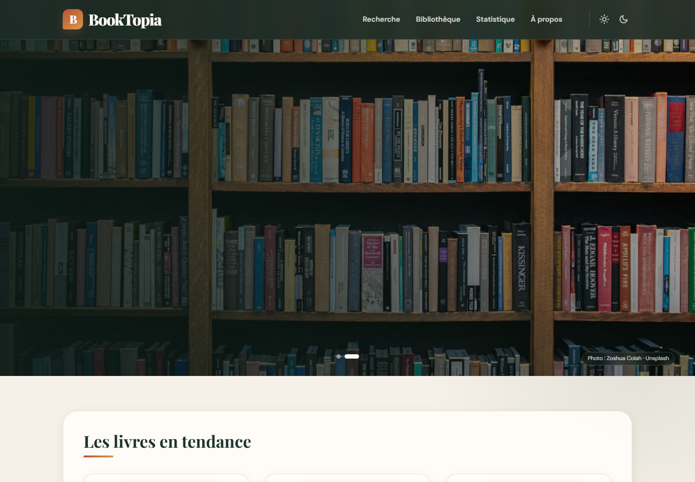
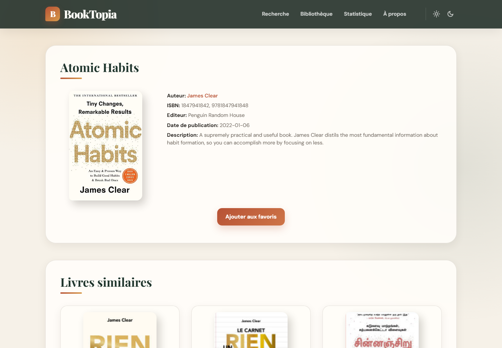

<div align="center">
  
  <h1>📚 BookTopia</h1>
  <p>
    <strong>Bibliothèque numérique moderne en PHP pour rechercher, découvrir et organiser ses prochaines lectures.</strong>
    <br />
    <br />
    <a href="https://booktopia.fr"><strong>🌐 Visiter l’application</strong></a>
    ·
    <a href="docs/Rapport-de-projet-dev-web.pdf"><strong>📄 Consulter le rapport</strong></a>
    ·
    <a href="https://github.com/Aybskt/BookTopia/issues"><strong>🐞 Signaler un problème</strong></a>
  </p>
</div>

<div align="center">
  
  
  
  
  
  
</div>

<br />

---

## Table des matières

1. [🌟 À propos](#-à-propos)
2. [✨ Fonctionnalités](#-fonctionnalités)
3. [🧰 Technologies et APIs](#-technologies-et-apis)
4. [🏗️ Architecture](#️-architecture)
5. [📸 Aperçu](#-aperçu)
6. [🚀 Démarrage rapide](#-démarrage-rapide)
7. [⚙️ Configuration](#️-configuration)
8. [⚡ Performance et robustesse](#-performance-et-robustesse)
9. [🌐 Déploiement](#-déploiement)
10. [👥 Équipe](#-équipe)
11. [📚 Documentation](#-documentation)
12. [📜 Licence](#-licence)

---

## 🌟 À propos

**BookTopia** centralise la découverte de livres dans une interface élégante, accessible et responsive. L’application combine plusieurs APIs publiques pour proposer des recherches précises, des fiches détaillées, des biographies d’auteurs en français, des tendances de lecture et une bibliothèque personnelle présentée comme une véritable étagère.

Le projet reste volontairement léger : **PHP natif, JavaScript sans framework, cache fichier et aucune base de données obligatoire**.

---

## ✨ Fonctionnalités

- 🔎 **Recherche avancée** par titre ou auteur avec cinq pages de résultats.
- 📖 **Fiches détaillées** avec couverture, ISBN, éditeur, date, description et livres similaires.
- 👤 **Biographies d’auteurs** en français avec portrait et sélection de leurs ouvrages.
- 🔥 **Tendances hebdomadaires** alimentées par OpenLibrary.
- 🆕 **Dernières sorties** filtrées et triées par date de publication réelle.
- 📈 **Livres populaires** classés selon les journaux de lecture OpenLibrary.
- 🪵 **Bibliothèque personnelle** au design d’étagère avec gestion des favoris.
- 📊 **Statistiques** de consultation générées avec JpGraph.
- 🌗 **Thèmes clair et sombre** avec conservation du contexte de navigation.
- 🖼️ **Hero Unsplash quotidien** avec attribution dynamique et fallback local.
- 📱 **Design responsive** adapté aux mobiles, tablettes et grands écrans.
- ♿ **Navigation accessible** : textes alternatifs, états actifs et contrôles clavier.

---

## 🧰 Technologies et APIs

| Technologie | Rôle |
|---|---|
| **PHP 8+** | Rendu serveur, appels API, cache et logique applicative. |
| **HTML5 / CSS3** | Structure sémantique, design responsive et thèmes. |
| **JavaScript** | Interactions, navigation, favoris et carrousel. |
| **Swiper** | Slider de la page d’accueil. |
| **JpGraph** | Génération des graphiques statistiques. |
| **Google Books API** | Recherche, identifiants et fiches bibliographiques. |
| **OpenLibrary API** | Tendances, popularité, auteurs et couvertures. |
| **Wikipedia REST API** | Biographies et portraits d’auteurs. |
| **Unsplash API** | Sélection quotidienne des visuels du hero. |
| **NASA APOD / IPinfo** | Contenu enrichi de la page Tech. |

---

## 🏗️ Architecture

```text
BookTopia/
├── assets/                     # Captures utilisées par GitHub
├── docs/                       # Rapport et documentation technique
├── src/                        # Racine publique de l’application
│   ├── include/
│   │   ├── functions.inc.php  # APIs, cache et helpers communs
│   │   ├── header.inc.php
│   │   ├── footer.inc.php
│   │   └── util.inc.php
│   ├── images/                 # Images locales et fallbacks
│   ├── js/app.js               # Interactions principales
│   ├── jpgraph/                # Bibliothèque graphique embarquée
│   ├── swiper/                 # Composant de carrousel
│   ├── index.php               # Accueil et sélections éditoriales
│   ├── page-de-recherche.php   # Recherche et pagination
│   ├── details.php             # Fiche d’un livre
│   ├── data_auteur.php         # Biographie d’un auteur
│   └── bibliotheque.php        # Favoris et étagères
└── storage/
    └── config.example.json     # Modèle de configuration sans secrets
```

Les données privées, statistiques CSV, caches et clés API restent hors du dépôt grâce au fichier `.gitignore`.

---

## 📸 Aperçu

<table>
  <tr>
    <td></td>
    <td></td>
  </tr>
  <tr>
    <td align="center"><em>Accueil, hero quotidien et tendances</em></td>
    <td align="center"><em>Fiche livre et recommandations similaires</em></td>
  </tr>
</table>

---

## 🚀 Démarrage rapide

### Prérequis

- **PHP 8.0** ou supérieur ;
- extension PHP **cURL** activée ;
- extension **GD** pour les graphiques JpGraph ;
- accès en écriture au dossier `storage/` en local.

### Installation

```bash
git clone https://github.com/Aybskt/BookTopia.git
cd BookTopia
```

Copiez ensuite le modèle de configuration :

```bash
cp storage/config.example.json storage/config.json
```

Sous PowerShell :

```powershell
Copy-Item storage/config.example.json storage/config.json
```

Renseignez vos clés dans `storage/config.json`, puis démarrez le serveur :

```bash
php -S localhost:8000 -t src
```

Ouvrez **http://localhost:8000** dans votre navigateur.

---

## ⚙️ Configuration

| Clé | Service | Obligatoire |
|---|---|---|
| `key_api` | Google Books | Recommandée |
| `unsplash_key` | Unsplash | Non, fallback local disponible |
| `nasa_key` | NASA APOD | Non |
| `ipinfo_token` | IPinfo | Non |
| `ip2location_key` | IP2Location | Non |

> Ne publiez jamais `storage/config.json`. Seul `config.example.json` doit être versionné.

---

## ⚡ Performance et robustesse

- cache JSON par URL avec un TTL de **900 secondes** ;
- cache quotidien dédié aux images Unsplash ;
- timeouts courts et fallbacks pour chaque service externe ;
- requêtes Google Books limitées aux champs réellement utilisés ;
- couvertures locales pour les contenus critiques de l’accueil ;
- chargement différé et décodage asynchrone des images secondaires ;
- échappement HTML systématique des données externes ;
- aucune erreur fatale lorsque Google Books, OpenLibrary ou Wikipedia est indisponible.

---

## 🌐 Déploiement

La racine web doit pointer directement vers le dossier `src/`. Sur un hébergement mutualisé utilisant `htdocs`, copiez le contenu de `src/` dans le dossier public et créez le fichier de configuration dans le stockage privé prévu par l’hébergement.

Version publique : **[https://booktopia.fr](https://booktopia.fr)**

---

## 👥 Équipe

- **Ayoub ABDELLI**
- **Lounis BOUHADOUN**
- Groupe universitaire **A04**

---

## 📚 Documentation

- [Rapport du projet](docs/Rapport-de-projet-dev-web.pdf)
- [Audit avant publication](docs/AMELIORATIONS_AVANT_PUBLICATION.md)
- [Documentation PHP générée](docs/api/html/index.html)

---

## 📜 Licence

Ce projet est distribué sous licence **MIT**. Consultez le fichier [LICENSE](LICENSE) pour plus d’informations.

Copyright © 2026 — Ayoub ABDELLI & Lounis BOUHADOUN
